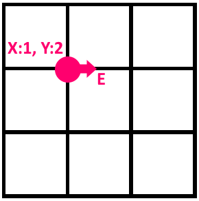

<p align="center">
    <svg xmlns="http://www.w3.org/2000/svg" x="0px" y="0px"
    width="120" height="120"
    viewBox="0 0 226 226"
    style=" fill:#000000;"><g fill="none" fill-rule="nonzero" stroke="none" stroke-width="1" stroke-linecap="butt" stroke-linejoin="miter" stroke-miterlimit="10" stroke-dasharray="" stroke-dashoffset="0" font-family="none" font-weight="none" font-size="none" text-anchor="none" style="mix-blend-mode: normal"><path d="M0,226v-226h226v226z" fill="none"></path><g id="Layer_1"><circle cx="37.3" cy="33" transform="scale(4.70833,4.70833)" r="4" fill="#37474f"></circle><path d="M211.40417,147.84167c0,-0.94167 0.47083,-1.88333 0.47083,-2.825v-5.65c0,-48.49583 -99.81667,-82.86667 -153.9625,-82.86667c-30.13333,0 -34.37083,10.82917 -34.37083,16.95v68.74167l2.825,5.65z" fill="#1abc9c"></path><path d="M211.875,145.95833h-127.125v18.83333h106.40833c10.82917,0 19.775,-8.475 20.71667,-18.83333z" fill="#95a5a6"></path><circle cx="13" cy="27" transform="scale(4.70833,4.70833)" r="8.5" fill="#b0bec5"></circle><path d="M61.20833,174.20833c-25.89583,0 -47.08333,-21.1875 -47.08333,-47.08333c0,-25.89583 21.1875,-47.08333 47.08333,-47.08333c25.89583,0 47.08333,21.1875 47.08333,47.08333c0,25.89583 -21.1875,47.08333 -47.08333,47.08333zM61.20833,94.16667c-18.3625,0 -32.95833,14.59583 -32.95833,32.95833c0,18.3625 14.59583,32.95833 32.95833,32.95833c18.3625,0 32.95833,-14.59583 32.95833,-32.95833c0,-18.3625 -14.59583,-32.95833 -32.95833,-32.95833z" fill="#37474f"></path></g></g></svg>
</p>
<p align="center" style="font-size:25px;font-style:bold">Automatic Mower App<p/>

## Use case
The company X wants to develop an automower for square surfaces.

<a href="#">
    
</a>

The mower can be programmed to go throughout the whole surface. 

Mower's position is represented by coordinates (X,Y) and a characters indicate the orientation according to cardinal notations (N,E,W,S). The lawn is divided in grid to simplify navigation.

For example, the position can be 0,0,N, meaning the mower is in the lower left of the lawn, and oriented to the north.

### Example

In that example, mower position is 1,2,E :
<br/>
<a href="#">
    
</a>

To control the mower, we send a simple sequence of characters. 

Possibles characters are L,R,F. L and R turn the mower at 90° on the left or right without moving the mower. F means the mower move forward from one space in the direction in which it faces and without changing the orientation.

If the position after moving is outside the lawn, mower keep it's position. Retains its orientation and go to the next command.
We assume the position directly to the north of (X,Y) is (X,Y+1).

To program the mower, we can provide an input file constructed as follows:

The first line correspond to the coordinate of the upper right corner of the lawn. The bottom left corner is assumed as (0,0). The rest of the file can control multiple
mowers deployed on the lawn. Each mower has 2 next lines : The first line give mower's starting position and orientation as "X Y O". X and Y being the position and O the orientation.

The second line give instructions to the mower to go throughout the lawn.
Instructions are characters without spaces.
Each mower move sequentially, meaning that the second mower moves only when the first has fully performed its series of instructions.
When a mower has finished, it give the final position and orientation.

## Example

input file
```
5 5
1 2 N
LFLFLFLFF
3 3 E
FFRFFRFRRF
```

result
```
1 3 N
5 1 E
```

## Diagram

<a href="#">
    
</a>

## Getting Started
...

### Prerequisites
...
### Installation
...
## Screenshot

<a href="#">
    
</a>

## TODO
* Create a DockerFile to publish the project
* Adding Sonar for code coverage
* Improve collisions by adding a collision check between mowers 
* Adding more tests, actually very poor